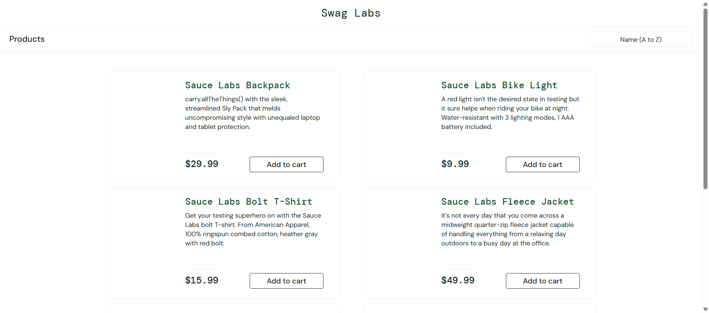
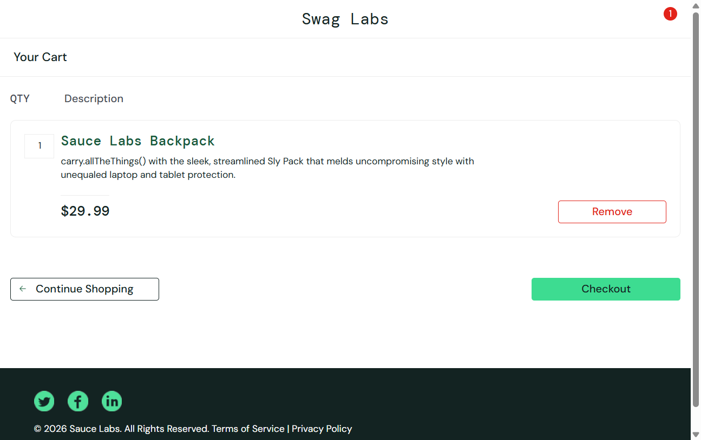
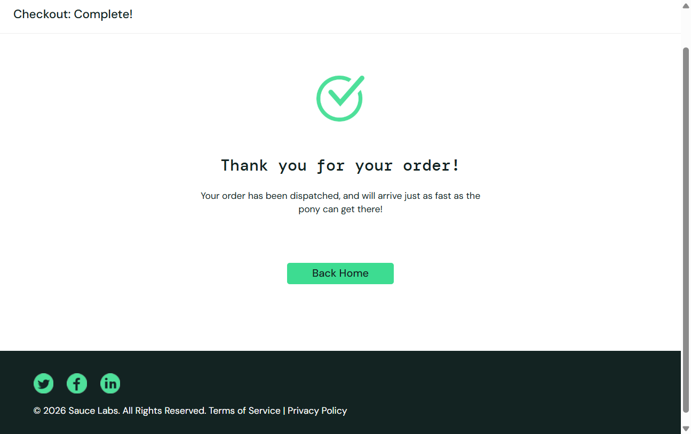
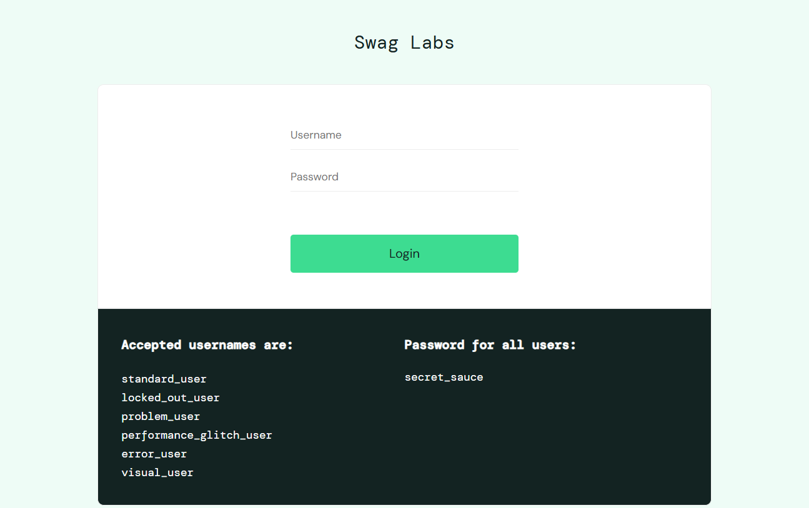
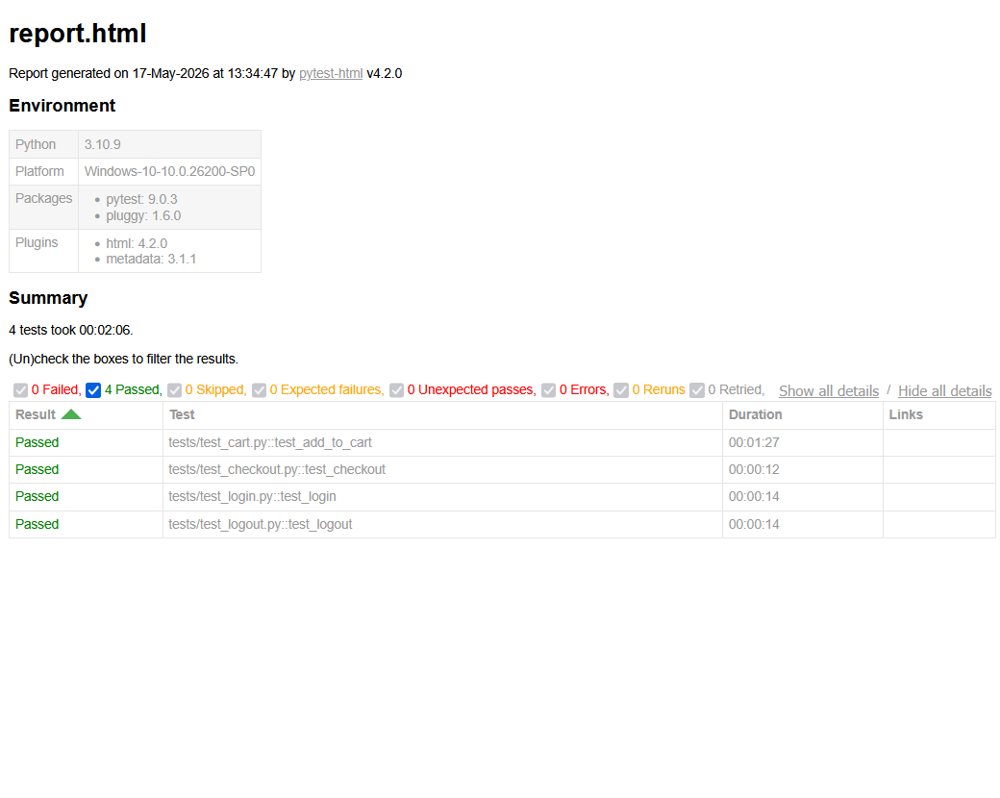

# 🛒 E-Commerce Website Testing Automation

This project automates testing of the SauceDemo e-commerce website using Selenium WebDriver with Python and Pytest Framework.


---

# 📌 Project Overview

The main objective of this project is to perform:

- Manual Testing
- Automation Testing
- Functional Testing
- UI Testing

on the SauceDemo E-Commerce application.

🔗 Website Used:  
https://www.saucedemo.com/

---

# 🚀 Features Automated

✅ Login Functionality  
✅ Add Product to Cart  
✅ Remove Product from Cart  
✅ Checkout Process  
✅ Logout Functionality  
✅ Screenshot Capture  
✅ HTML Report Generation  

---

# 🛠 Technologies Used

<table>
<tr>
<td align="center" width="180">


### Python

</td>

<td align="center" width="180">


### Selenium WebDriver

</td>

<td align="center" width="180">


### Pytest Framework

</td>

</tr>
<tr>

<td align="center" width="180">


### Pytest HTML Report

</td>

<td align="center" width="180">


### VS Code

</td>

<td align="center" width="180">


### Google Chrome

</td>
</tr>
</table>

---

# 📂 Project Structure

```bash
Ecommerce_Testing_Project/
│
├── tests/
│   ├── test_login.py
│   ├── test_cart.py
│   ├── test_checkout.py
│   └── test_logout.py
│
├── pages/
│   ├── login_page.py
│   ├── cart_page.py
│   ├── checkout_page.py
│   └── logout_page.py
│
├── screenshots/
├── reports/
├── manual_testing/
│
├── README.md
├── pytest.ini
├── conftest.py
└── requirements.txt
```

---

# ▶️ How to Run the Project

## Step 1 — Clone Repository

```bash
git clone https://github.com/prajwalchaudhari60/Ecommerce_Testing_Project.git
```

---

## Step 2 — Navigate to Project Folder

```bash
cd Ecommerce_Testing_Project
```

---

## Step 3 — Install Dependencies

```bash
pip install -r requirements.txt
```

---

## Step 4 — Run Automation Tests

```bash
python -m pytest
```

---

## Step 5 — Generate HTML Report

```bash
pytest --html=reports/report.html
```

---

# 📸 Project Screenshots

Screenshots are automatically saved inside the `screenshots/` folder after test execution.

## 🔐 Login Test



---

## 🛒 Cart Test



---

## 💳 Checkout Test



---

## 🚪 Logout Test



---

# 📊 HTML Report

HTML reports are generated inside the `reports/` folder.



---

# 🧪 Test Scenarios Covered

| Module | Test Scenario |
|---|---|
| Login | Valid & Invalid Login |
| Cart | Add & Remove Product |
| Checkout | Complete Checkout Process |
| Logout | Logout Functionality |

---

# 📁 Manual Testing Documents

The project also contains manual testing documentation inside the `manual_testing/` folder:

- ✅ Test Cases
- ✅ Bug Reports
- ✅ RTM (Requirement Traceability Matrix)
- ✅ Test Plan
- ✅ Test Execution Report

---

# ⚙️ Automation Framework

This project follows the **Page Object Model (POM)** framework structure.

## Framework Advantages

- Reusable Code
- Better Maintainability
- Easy Test Execution
- Improved Readability
- Scalable Automation Structure

---

# 👨‍💻 Author

## Prajwal Chaudhari

🔗 GitHub Profile:  
https://github.com/prajwalchaudhari60

---

# ⭐ Future Enhancements

- Data Driven Testing
- Jenkins CI/CD Integration
- Logging Framework
- Cross Browser Testing
- Headless Browser Execution
- Docker Integration

---

# 📌 Conclusion

This project demonstrates real-time QA Automation Testing concepts using Selenium, Python, and Pytest.

The framework validates major e-commerce functionalities and generates professional HTML reports with proper test execution results.